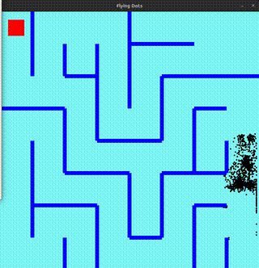
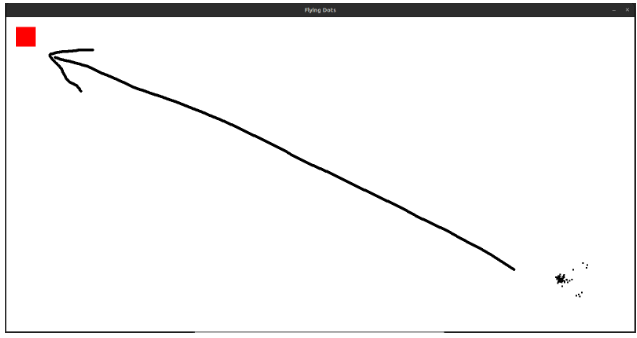
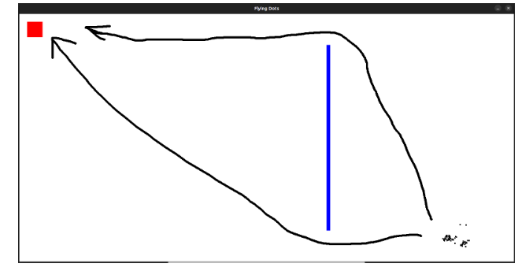
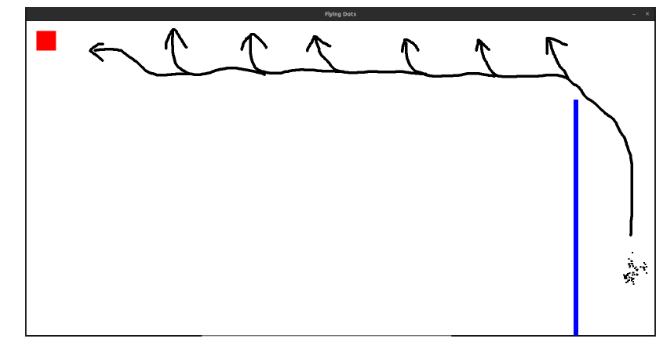
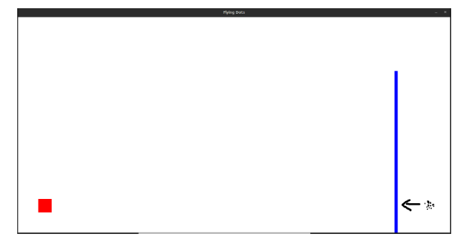
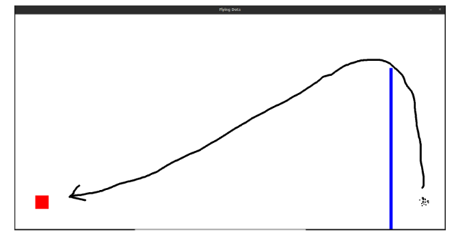
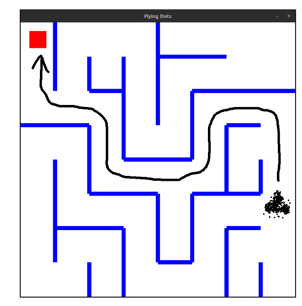

# **Genetic Algorithm Maze Solver**

This project simulates a genetic algorithm to solve a maze using Python and Pygame. The simulation includes flying dots that attempt to navigate the maze to reach a target (red dot). The algorithm evolves over generations to improve the pathfinding capabilities of the dots.

## **Additional Documentation**

For detailed documentation and seminar papers related to this project, please refer to the [seminar paper folder](./seminar-paper).


## **Requirements**

- **Python 3.x**
- **pygame 2.5.2** (SDL 2.28.2, Python 3.10.9)
- **Matplotlib**

## **How to Run the Simulation**

### **Clone the Repository:**

```bash
git clone https://github.com/your-repo/genetic-algorithm-maze-solver.git
cd genetic-algorithm-maze-solver
```

Install Dependencies:

```bash
pip install pygame matplotlib
```

Run the Simulation:

```bash
python main.py
```

### **Changing Simulation and Speed Simulation**

The simulation variable determines which maze and setup to use. There are 8 different simulations you can run, each with a different maze configuration.

To change the simulation, modify the simulation variable in the main.py file:

```bash
simulation = 1  # Change this value from 1 to 8 to select different simulations
```

The speed variable controls the speed of the simulation. The higher the value, the slower the simulation will run.

To change the speed, modify the speed variable in the main.py file:

```bash
speed = 100  # Change this value to adjust the speed of the simulation
```

### **How It Works**

    Initialization:
        The simulation initializes with a population of dots, a target (red dot), and a maze.
        Each dot has a Brain object that determines its movement.

    Fitness Calculation:
        The fitness of each dot is calculated based on its distance from the target.
        Dots that collide with walls receive a lower fitness score.

    Selection and Crossover:
        The dots are sorted based on their fitness.
        Top-performing dots are selected for crossover to produce offspring.

    Mutation:
        The directions of the offspring are slightly mutated to introduce variability.

    Iteration:
        The process repeats for multiple generations, with each generation expected to perform better than the previous one.

## ** FINAL Video Demonstration**



### Screenshots

#### Simulation 1


#### Simulation 2


#### Simulation 3


#### Simulation 4


#### Simulation 5


#### Simulation 8


### UPDATE:
2 MORE SIMULATIONS - > 1,2,3,4,5,6,7,8


License

This project is licensed under the MIT License.
